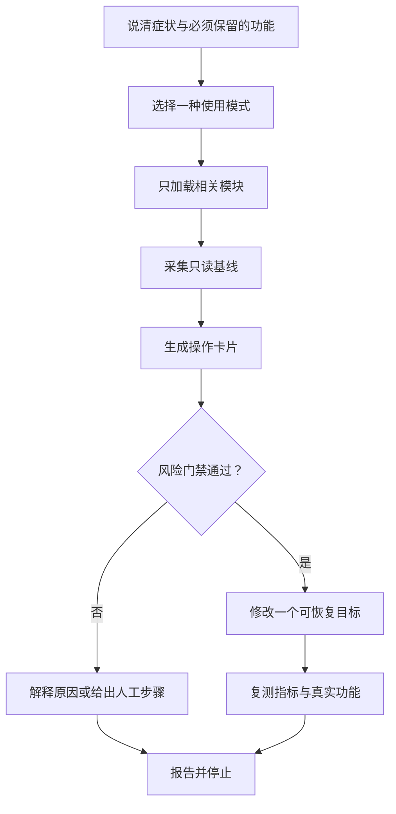
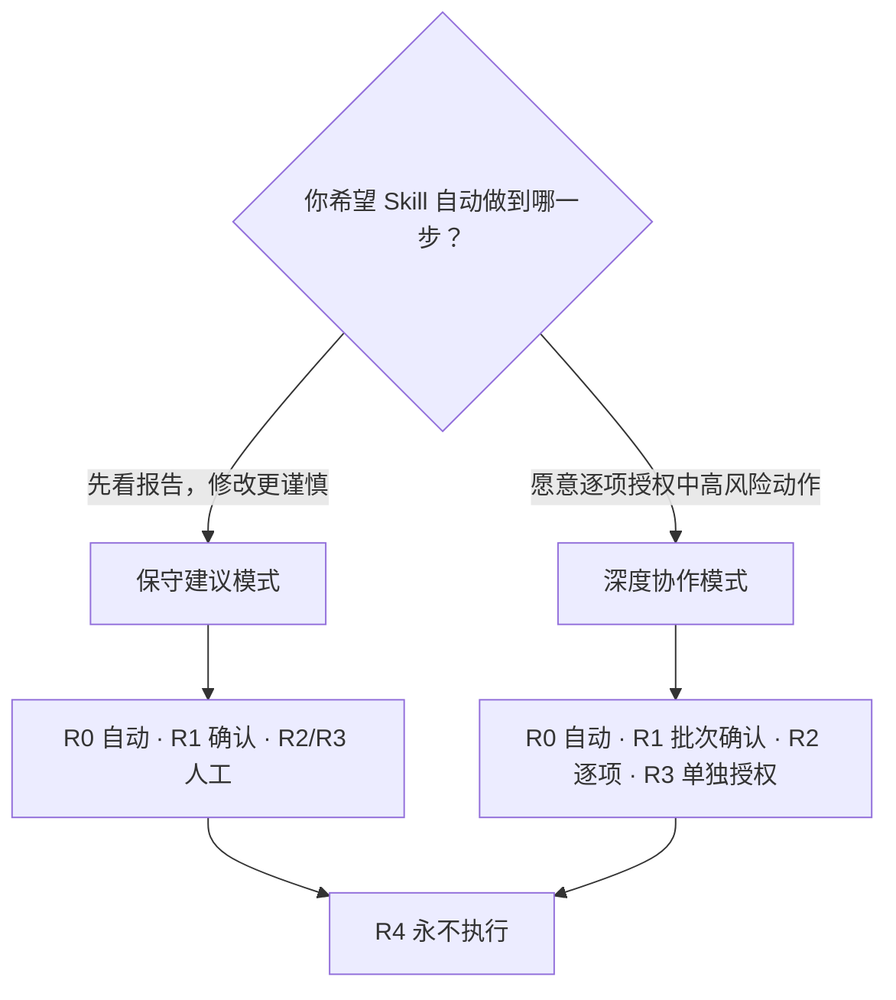
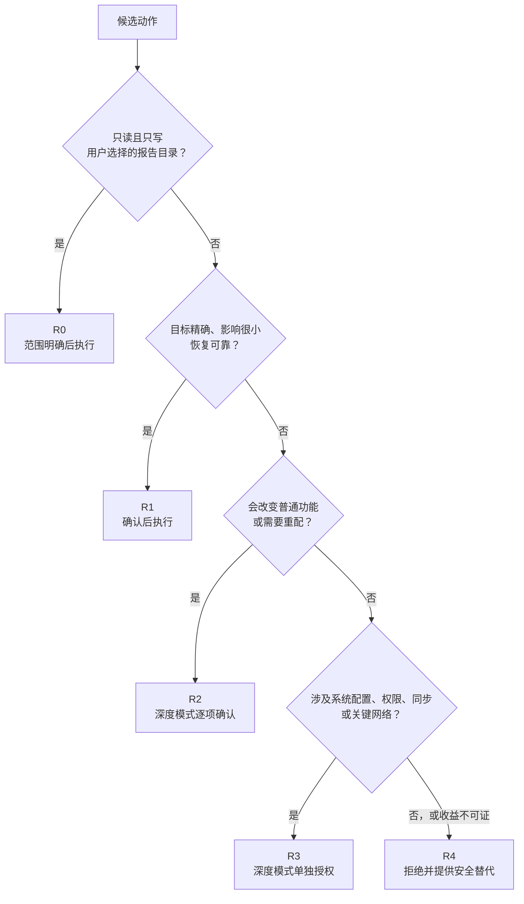

<p align="center">
  
  
  
  
</p>

<p align="center">
  简体中文 · <a href="README.en.md">English</a> · <a href="#三分钟开始">三分钟开始</a> · <a href="#九个能力模块">能力范围</a> · <a href="#安全边界">安全边界</a>
</p>

> 用一套可审计的流程处理 Windows 空间、内存、速度、代理、安全和新机设置：先只读检查，再按风险确认，最后用新证据验证。

**先选一种：** 🧭 [保守建议](#两种使用模式)，只读报告优先；或 🛠️ [深度协作](#两种使用模式)，逐项授权中高风险动作。**下一步：** 跳到 [三分钟开始](#三分钟开始)，安装后直接描述症状和必须保留的功能。

磁盘清理、开机内存和代理重连看起来都像“电脑需要优化”，但它们没有同一条万能命令。删错一个重解析点可能影响云同步，关错一个服务可能破坏登录或更新，改完代理却只测普通网页，也证明不了 WebSocket 已恢复。

`windows-safe-optimizer` 把这些问题整理成一个供 Codex 使用的 Agent Skill。它先确认设备用途、必须保留的功能和当前症状，然后建立只读基线；需要修改时，每个候选都附带证据、功能影响、风险等级、备份、回退和验证。你仍然做决定，Skill 负责把决定需要的信息摆在同一张操作卡片上。

它适合刚拿到电脑、不熟悉 Windows 系统项的人，也适合希望把零散优化经验变成可复查流程的用户。它不是一键清理器，不承诺所有电脑获得同样的空间、内存或延迟收益。

## 它解决什么问题

- **C 盘只剩 8 GB：** 先区分安装包、缓存、应用数据、休眠文件和云同步边界，再判断哪些空间真实可回收。
- **开机内存显示 40%：** 用“重启后静置”的可比基线确认是否存在压力，而不是按进程数量或截图数字批量关服务。
- **网页能开，Codex 却持续重连：** 分别验证 DNS、TLS、HTTP、SSE、WebSocket 和代理链路，配置一次只改一个对象。
- **通知很多，界面很乱：** 保留安全、更新和账号异常提醒，只整理推荐内容、普通应用通知与用户明确不需要的入口。
- **新电脑不知道先做什么：** 从更新、安全、恢复、备份和账户角色开始，再按办公、游戏或开发用途选择软件与存储布局。

## 你会得到什么

| 交付 | 具体内容 |
|---|---|
| 只读基线 | Windows 版本、卷容量、内存、启动项、更新和安全状态等与当前问题有关的证据 |
| 操作卡片 | 发现、证据、预期收益、功能影响、R0–R4、精确动作、备份、回退、验证与停止条件 |
| 风险门禁 | 低风险按清单确认，中高风险逐项处理，禁止级动作直接拒绝 |
| 结束报告 | 做了什么、没做什么、验证结果、仍不确定的部分，以及为什么应该停止继续优化 |



## 两种使用模式

第一次开始时，Skill 会让你选一种模式。没有选择时默认停留在保守建议模式。

| | 🧭 保守建议 `conservative-advice` | 🛠️ 深度协作 `deep-collaboration` |
|---|---|---|
| 只读检查 R0 | 在范围和输出目录明确后执行 | 在范围和输出目录明确后执行 |
| 低风险 R1 | 展示清单，确认后执行 | 同类目标可成批展示，确认一次后执行 |
| 中风险 R2 | 只说明、备份、回退和人工步骤 | 每个精确目标分别确认 |
| 高风险 R3 | 只说明、备份、回退和人工步骤 | 一个动作一次授权，并先备份 |
| 禁止级 R4 | 拒绝，并给更安全的替代路径 | 同样拒绝 |



> [!IMPORTANT]
> “帮我优化一下”不是修改授权。切换模式也不会跳过操作卡片、备份或风险确认；托管的公司/学校设备默认只给建议，除非存在可核验的书面授权和精确范围。

## 三分钟开始

### 1. 安装

在 PowerShell 中先关闭第三方安装器的可选遥测，再安装 Skill：

```powershell
$env:DO_NOT_TRACK = '1'
npx skills add tairael/windows-safe-optimizer --skill windows-safe-optimizer -g -a codex
```

> [!NOTE]
> Skill 自带的两支 PowerShell 脚本不联网、没有遥测，也不会读取密码、浏览历史或个人文件内容。上面的 `skills` CLI 是第三方安装工具，可能采用独立的遥测策略，因此这里明确推荐设置 `DO_NOT_TRACK=1`。请在执行前查看它当前版本的隐私说明。

### 2. 发出第一条请求

直接把症状、用途和不能受影响的功能告诉 Codex：

```text
请用 windows-safe-optimizer 检查这台 Windows 11 电脑。
我选保守建议模式。C 盘空间不足，但 OneDrive、休眠和开发环境必须正常；先只读扫描并生成报告。
```

安装成功后，Codex 应先写出 `Mode:`，确认 Windows 版本、设备归属和报告目录，再开始检查。更多可复制场景见 [示例提示词](examples/example-prompts.md)。

<details>
<summary><strong>手动安装与排查</strong></summary>

仓库中的 Skill 位于 `skills/windows-safe-optimizer`。如果自动安装不可用，可把这个目录完整复制到 Codex 能发现的 Skills 目录；不要只复制 `SKILL.md`，因为九份参考资料和两支只读脚本也是运行时内容。

安装后若没有触发：

1. 检查目录名和 Skill 名是否都为 `windows-safe-optimizer`。
2. 重新打开一个 Codex 任务，明确写出“使用 windows-safe-optimizer”。
3. 请 Codex 先运行环境检查，不要为了通过检查而更改执行策略或请求管理员权限。

</details>

## 九个能力模块

Skill 只读取当前问题需要的模块。问磁盘空间时不会顺便加载通知、卸载和新机清单。

| 模块 | 会检查什么 | 关键边界 |
|---|---|---|
| 💽 磁盘与空间 | 卷容量、大文件、缓存、安装介质、重复候选 | 不跨云同步、挂载点或重解析点递归；重复字节不等于可删除 |
| 🧠 内存与启动 | 可用内存、提交率、换页、进程组、启动项、服务 | 保留分页文件；用重启静置基线，不追逐任意占用百分比 |
| ⚡ 性能与响应 | CPU、存储压力、电源模式、更新、温度线索 | 先定位瓶颈，不套用注册表或计时器“加速参数” |
| 🌐 网络与代理 | DNS、TLS、HTTP、SSE、WebSocket、Clash/VPN | 测真实传输；不读取或回显代理凭据 |
| 🛡️ 安全与隐私 | Defender、防火墙、Update、UAC、加密、账户 | 不以关闭保护换取速度或更低的后台数字 |
| 🎛️ 界面与通知 | 任务栏、开始菜单、推荐、后台权限、通知 | 保留安全、更新和账号故障提醒 |
| 🧩 软件与功能 | 应用、厂商工具、共享组件、可选功能 | 用官方卸载；不把未知目录当“残留”删除 |
| 🌱 新机开荒 | 更新、恢复、备份、软件来源、存储布局 | 按用途提供选择，不自动安装或卸载一套通用清单 |
| ↩️ 备份与验证 | 原始状态、执行身份、备份、回退、复测 | R2/R3 必须加载；修改和验证保持同一真实用户上下文 |

## R0–R4：风险如何决定下一步

风险看真实对象和上下文，不只看命令名称。相同的“删除缓存”遇到 OneDrive、软件依赖、权限不明或不可验证的备份时，会升到更高等级。



> [!WARNING]
> Skill 永不执行或打包这些做法：关闭 Defender、防火墙、UAC、Windows Update 或设备加密；使用注册表/内存清理器；批量禁用服务；取得整棵目录所有权；把删除应用目录当作卸载；提供通用的一键 debloat、代理或权限脚本。

## 来自实测的方法

下面三个匿名案例来自一台电脑上的特定会话，不含设备或用户标识，只展示“如何缩小问题”，不是收益承诺。硬件、软件、时间窗口和用户习惯变化后，数字不会照搬。

### 💽 空间：8.28 GB → 73.45 GB

先按卷和目录归因，再逐项确认安装介质、可恢复缓存和用户已知的大文件。最终看的是卷可用空间，而不是把文件逻辑大小相加。云同步目录、程序内部重复文件和不明根目录没有被批量删除。

### 🧠 内存：约 42.0% → 38.1%

比较的是相同登录用户、重启后静置条件下的归一化读数。优化针对有明确所有者和用途的启动项，没有禁用分页文件、系统核心服务，也没有承诺降到某个好看的百分比。

### 🌐 代理：HTTP/SSE 正常，WebSocket 失败

普通网页可访问并不能证明实时连接正常。分层测试定位到传输差异后，才检查应用代理和 Clash/VPN 链路；每次变更都保留原配置，并在新会话重复同一种 WebSocket 测试。

## 安全边界

- 平台范围是 Windows 10/11 桌面电脑，不包括 Windows Server、macOS 或 Linux。
- 公司、学校或其他托管设备在所有权与策略未确认前保持建议模式，不动 VPN、零信任、终端安全和设备管理组件。
- 两支打包脚本只做环境检查和基线采集。默认写入仅限用户明确选择、已经存在且通过安全检查的报告目录。
- 访问被拒绝与对象不存在会分开记录；Skill 不会仅为了“看得更多”请求提权。
- 每项修改都要复测原症状与受影响功能。出现回归、证据不足或收益递减时停止并回退。

完整威胁模型、支持范围和漏洞报告方式见 [SECURITY.md](SECURITY.md)。

## 隐私

Skill 不采集密码、Cookie、浏览历史、令牌、Wi-Fi 密码、代理凭据、个人文档内容或聊天记录，也不默认联网。基线报告可能包含软件名称、卷标签或非敏感路径；公开分享前仍应由用户检查并脱敏设备名、用户名、序列号、组织信息、公网地址和敏感路径。

[示例报告](examples/sample-report.md) 使用完全虚构的主机与数值，不能当作真实电脑的健康结论。

## 兼容性与支持状态

| 环境 | 状态 |
|---|---|
| Windows 11 桌面版 | 支持；实际可见信息仍受版本、权限、厂商定制和策略影响 |
| Windows 10 桌面版 | 支持诊断；常规支持已于 2025-10-14 结束，必须如实核对版本、ESU 资格和安全更新状态 |
| 企业/学校托管电脑 | 只读与建议优先；变更需要可核验授权、精确对象和策略复测 |
| Windows Server / 其他系统 | 不支持，平台检查后停止 |

PowerShell 脚本以 Windows PowerShell 5.1+ 为基线。某些结论需要真实登录用户、重启或更长观察时间；本 Skill 不能替代恶意软件应急响应、硬件维修、企业管理员或数据恢复服务。

## 常见问题

<details>
<summary><strong>它能一键清理和加速吗？</strong></summary>

不能，也不应该。不同电脑的可删除对象、必须保留功能和恢复条件不同。Skill 会自动完成允许的只读检查，但修改始终经过模式和风险门禁。

</details>

<details>
<summary><strong>为什么正常的 40% 内存占用不一定要优化？</strong></summary>

Windows 会利用空闲内存做缓存，浏览器和开发工具也可能拆成多个进程。只有在可比条件下同时出现提交压力、频繁换页、卡顿或明确的异常增长，才值得继续定位。

</details>

<details>
<summary><strong>需要管理员权限吗？</strong></summary>

基础扫描不为扩大范围而请求管理员权限。某个已确认动作确实需要提权时，操作卡片会写明精确目标、执行身份、原因和回退；权限本身不构成批准。

</details>

<details>
<summary><strong>如何卸载这个 Skill？</strong></summary>

删除 Agent 的 Skills 目录中对应的 `windows-safe-optimizer` 文件夹即可。Skill 不安装常驻服务、计划任务或后台程序；第三方安装器自身的缓存和配置请按该工具的文档处理。

</details>

## 参与改进

新增建议必须带来源或复现证据、适用范围、风险等级、功能影响、备份、回退和验证；只凭“网上都这么调”不会合并。完整流程见 [CONTRIBUTING.md](CONTRIBUTING.md)，公共文案遵循 [写作规范](docs/writing-style.md)。安全问题请按 [SECURITY.md](SECURITY.md) 私下报告。

本项目使用 [MIT License](LICENSE)。
